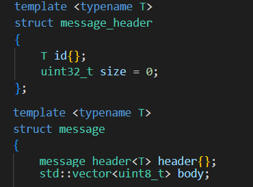

# Masive Multiplayer Online Server-Client using ASIO library

https://user-images.githubusercontent.com/65676644/175662381-0a3bf5a0-c93d-4586-ac56-9b2cf2be2d02.mp4

Created for educational purposes, this server and client prototypes were created on C++ to improve
my knowledge on network and low-level I/O programming. Some of the main topics i touch on the 
files are:

* client interface solution by creating connect/disconnect methods
* server interface solution capable of handling several client sockets, with its respective methods to
securely transfer data based on actions previously defined
* understand and apply thread-safe queues for multiple client connections on the same server and handle
outgoing or incoming messages by locking threads with mutex
* error handling for each of the connection steps, being the server, clients, connection, or messages interaction
* connection model which will be used by either the client or the server, handling certain methods
depending on the programs execution
* message templates with I/O overload to handle streams of any data type, avoiding incoming trivial data 

In this code, we can see how ASIO handles the temporal properties of network communication
by helping us execute the code when is necessary to do so. one of the problems encountered
on this HTTP example is we do not know in advance how much data is going to be sent, which is
pretty inconvenient with services such as streaming. The solution for this issue will be
handled on this code, we will handle those network request via messages, which
will be composed of: 

- a header, the header will have and identifier of what the message is
- the size,  of the entire message including the header request in bytes 
- a body,  which will be composed of zero or more bytes. 



The header will always be of a fixed size and is sent first, and its so it primes the system to know 
how much data memory must be opened for the body part of the message to be received.

As the messages received by an user can be of any type, the code must be flexible, the identifier
on the header is the one meant to know which kind of message we will receive, but this can 
be one of thousand different types of request, we could declare an enum class to classify the
request and make it more strict for the system to decide what to do with each of the requests,
but doing so limits the amount of messages we will receive as we would have to declare all kind
of messages we do not even know about now, so this solution will include the use of templates,
which will make the code more versatile when receiving the data

The connection will receive ownership definition (either client or server) , a reference of the ASIO 
context for connection handling, a unique socket handled by whoever is using the connection, and 
reference to the incoming message queue for either the client or the server interface. As the context 
and the incoming messages are references, the definition is imperative. The body of the connection will 
assign the ownership, the reason why it is not defined in the constructor header or listing is because 
we want to explicitly separate the critical and non critical information.


**ASIO library can be downloaded from https://think-async.com/Asio/**

**## DISCLAIMER:**

 The original dependencies and server architecture were taken as reference from David Barr, aka javidx9
 the comments on the code were all written by me, Luis Miguel Jaime Hernandez, by taking his videos
 and instructions as reference to learn some C++ coding, please refer to OneLoneCoder for additional
 information about the olcPixelGameEngine functionality.

```diff

 License (OLC-3)
	~~~~~~~~~~~~~~~
	Copyright 2018 - 2022 OneLoneCoder.com
	Redistribution and use in source and binary forms, with or without
	modification, are permitted provided that the following conditions
	are met:
	1. Redistributions or derivations of source code must retain the above
	copyright notice, this list of conditions and the following disclaimer.
	2. Redistributions or derivative works in binary form must reproduce
	the above copyright notice. This list of conditions and the following
	disclaimer must be reproduced in the documentation and/or other
	materials provided with the distribution.
	3. Neither the name of the copyright holder nor the names of its
	contributors may be used to endorse or promote products derived
	from this software without specific prior written permission.

	David Barr, aka javidx9, ©OneLoneCoder 2019, 2020, 2021

```
